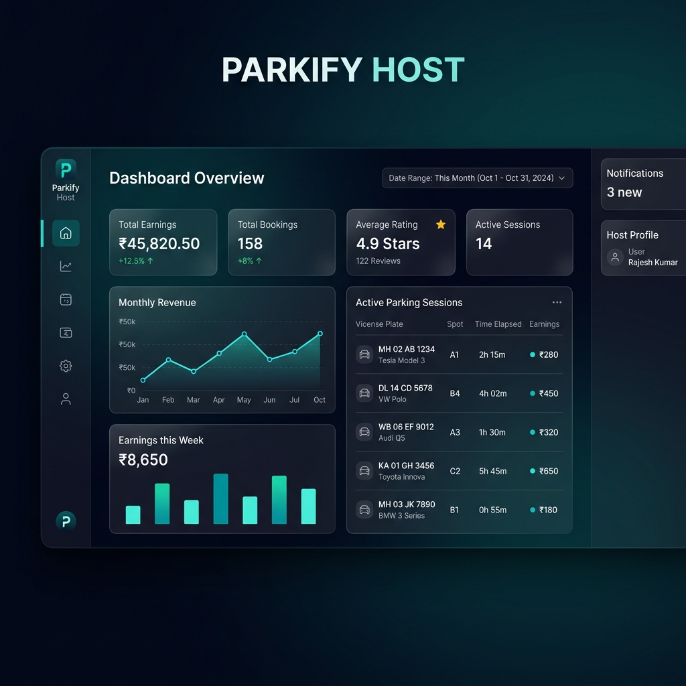

<div align="center">
  
  <h1>ParkEase: Smart Mobility Operating System</h1>
  <p><strong>A Premium, Real-time Parking Management Ecosystem</strong></p>

  [](https://laravel.com)
  [](https://www.mongodb.com)
  [](https://clerk.com)
  [](https://razorpay.com)
</div>

---

## 🌟 Overview
ParkEase is a sophisticated, SaaS-grade parking management platform designed to streamline urban mobility. It transitions from traditional parking solutions into a **Real-time Operating System** for both users looking for space and hosts managing their inventory.

Featuring a **Premium Glassmorphism UI**, the platform emphasizes operational clarity, visual excellence, and a seamless end-to-end booking lifecycle.

---

## ✨ Key Features

### 💎 Premium Experience
- **Interactive UI**: Built with a "Stripe/Linear" inspired aesthetic using Deep Teal (`#0E5E6F`) and Aqua Cyan.
- **Dynamic Animations**: Integrated local Lottie animations for a high-end, responsive feel.
- **Intelligent Dashboard**: Categorized session management (Active, Upcoming, Past, Cancelled) with live countdown timers.

### 🛡️ Secure Infrastructure
- **Enterprise Auth**: Powered by Clerk.js for robust, passwordless, and multi-role (User/Host) identity management.
- **KYC Gating**: Automated onboarding flow ensuring all parking hosts are verified before going live.
- **Data Scalability**: Leveraging MongoDB for high-performance geospatial searches and flexible schema management.

### 💳 Transactional Excellence
- **Razorpay Integration**: Production-ready UPI-First payment flow with cryptographic signature verification.
- **Automated Invoicing**: Real-time PDF ticket and receipt generation with QR validation tokens.
- **Smart Refunds**: Time-based cancellation logic with automated refund reconciliation (100% / 50% / 0% windows).

### 🔍 Discovery Engine
- **Geospatial Search**: Advanced Haversine distance filtering based on GPS coordinates or Pincode.
- **Interactive Map**: Visual parking lot discovery with real-time slot availability indicators.

---

## 🛠️ Tech Stack
| Layer | Technology |
| :--- | :--- |
| **Backend** | Laravel 11 (PHP 8.4+) |
| **Database** | MongoDB (NoSQL) |
| **Auth** | Clerk.js (Identity-as-a-Service) |
| **Payments** | Razorpay SDK |
| **UI** | Blade, Bootstrap 5, Vanilla JS, CSS3 (Glassmorphism) |
| **PDF** | Barryvdh DomPDF |

---

## 🚀 Getting Started

### 1. Prerequisites
- PHP 8.4+
- Composer
- MongoDB Instance
- Node.js & NPM

### 2. Installation
```bash
# Clone the repository
git clone https://github.com/ShivangChaurasia/ParkEase-Cost-Effective-Parking_System.git
cd ParkEase

# Install dependencies
composer install --ignore-platform-reqs
npm install

# Setup Environment
cp .env.example .env
php artisan key:generate
```

### 3. Configuration
Add your API keys to the `.env` file:
```env
# Clerk
VITE_CLERK_PUBLISHABLE_KEY=pk_test_...
CLERK_JS_URL=...

# Razorpay
RAZORPAY_KEY=rzp_test_...
RAZORPAY_SECRET=...
```

### 4. Launch
```bash
php artisan serve
```

---

## 📸 Screenshots
<div align="center">
  
  
</div>

---

## 📄 License
This project is licensed under the MIT License - see the [LICENSE](LICENSE) file for details.

<div align="center">
  <p>Built with ❤️ for a Seamless Urban Future.</p>
</div>
